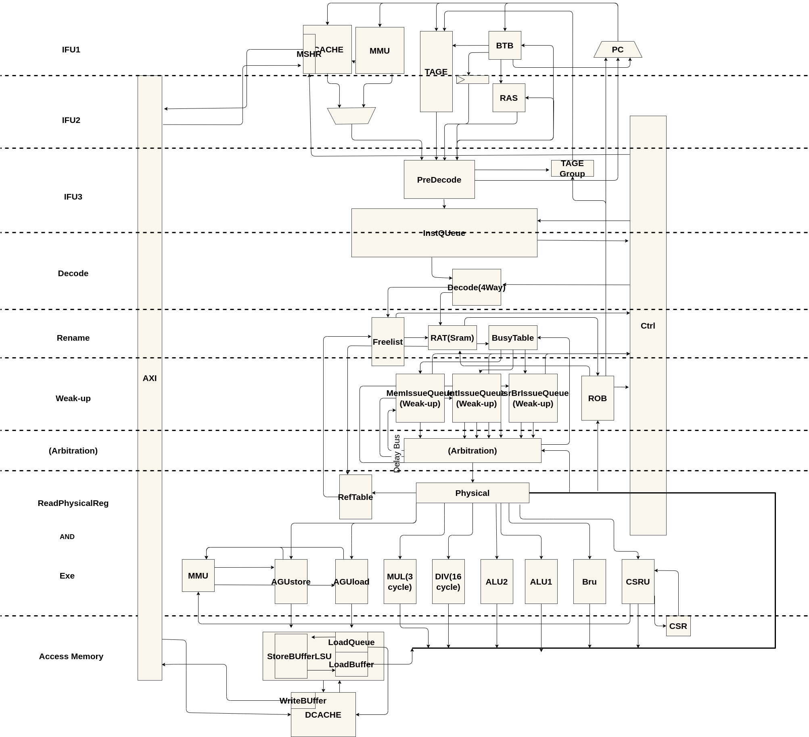

# LongArch-liguoqi-CPU

## This is my graduation project
### On Building
## Basic architecture diagram:

supplement some infromation:
| module | supplement | 
|----|----|
|RAT | Recover Rename Map use Arch State |
|ROB | when inst retir reg map update in aRAT|
|MUL | 3 cycle|
|DIv | 16 cycle|
|FreeList| Decode Rd infro will send Freelist Rename |
|(Weakup)Issue|this module weak up instraction use delay weak up.  but load need relay on realy load date back.|
